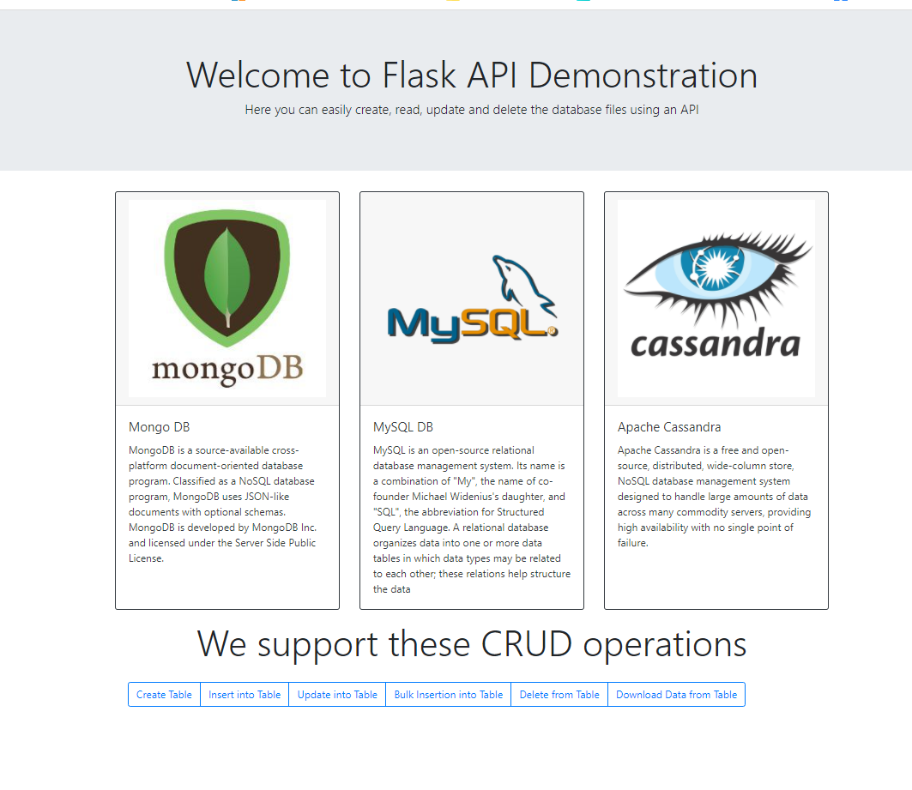
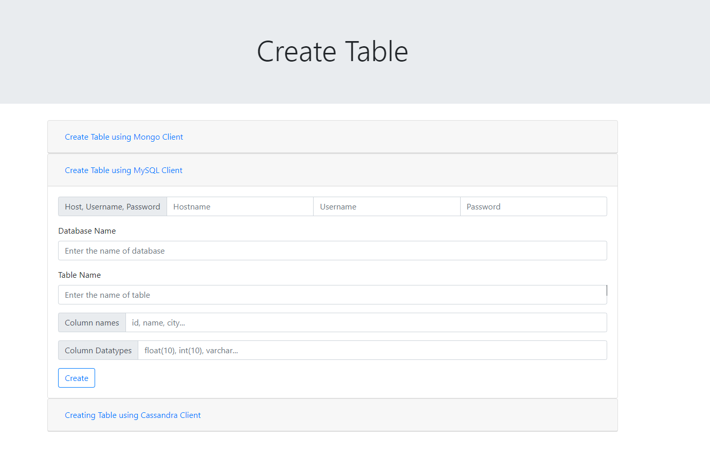
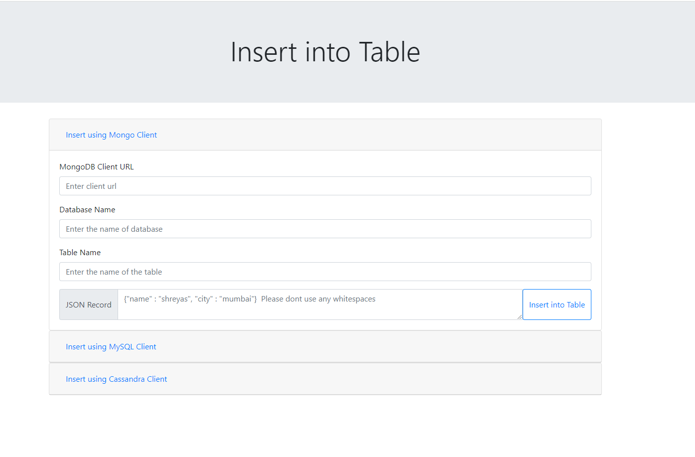
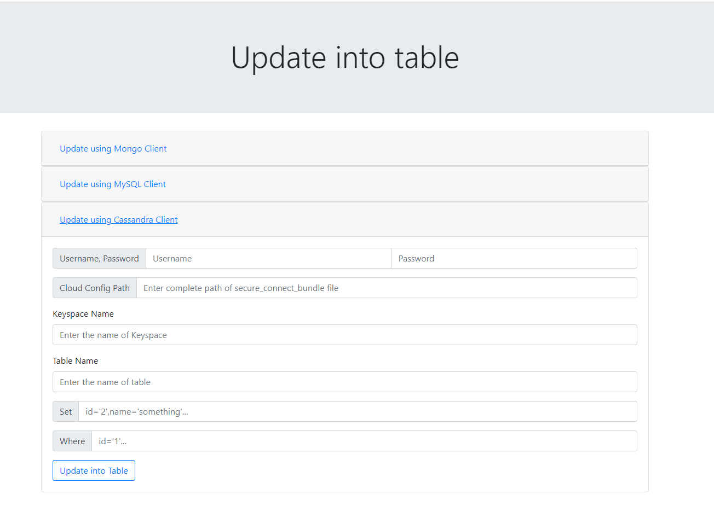
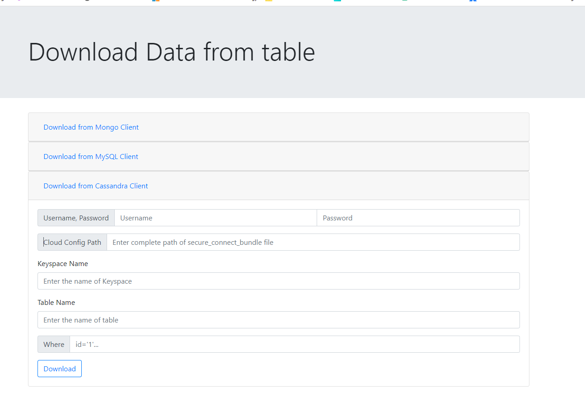
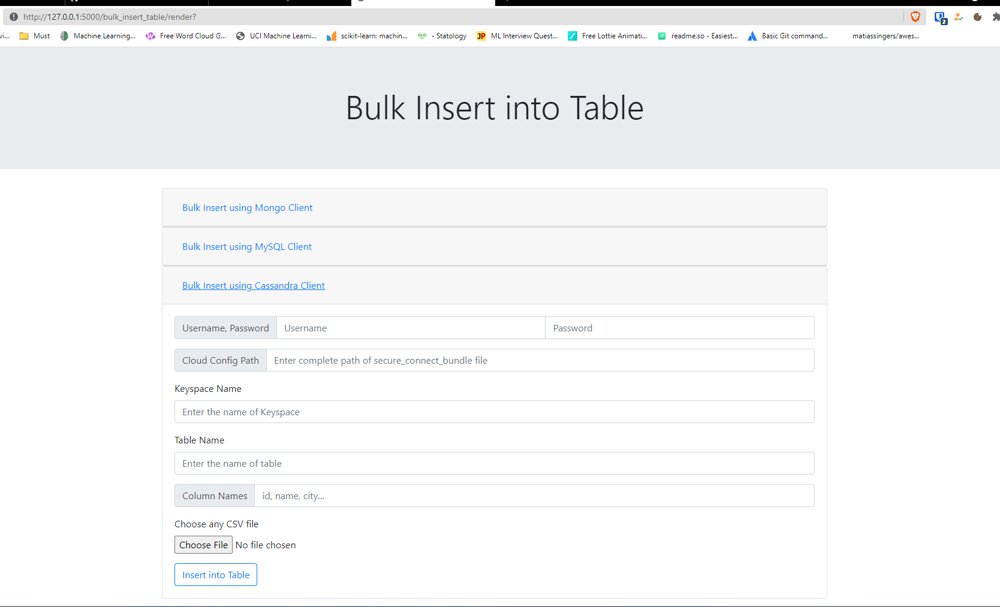

# <center>CRUD operations on SQL and NoSQL

Python flask api is created to perform the CRUD(Create, Delete, Update, Read, Bulk Insert) from the Databases like MySQL, MongoDB and Cassandra.
  
## <center>Features

- Responsive UI
- CRUD operations on three databases

## <center>Screenshots of project

<h3>1. Home Page</h3>
<p align="center">
  
</p>

<h3>2. Create Table</h3>
<p align="center">
  
</p>

<h3>3. Insert into Table</h3>
<p align="center">
  
</p>

<h3>4. Update table</h3>
<p align="center">
  
</p>

<h3>5. Download</h3>
<p align="center">
  
</p>

<h3>6. Bulk Insert</h3>
<p align="center">
  
</p>
  
## <center>Run Locally

Clone the project

```bash
  git clone https://github.com/Sparab16/Flask-API-Demonstration.git
```

Go to the project directory

```bash
  cd Flask-Api-Demonstration
```

Install dependencies

```bash
  pip install -r requirements.txt
```

Run the app.py

```bash
  python app.py
```

  
## <center>Usage

### Development

Want to contribute? Great!

To fix a bug or enhance an existing module, follow these steps:

<li> Fork the repo
<li> Create a new branch

```bash
 git checkout -b new-feature
```
<li> Make the appropriate changes in the file
<li> Commit your changes

```bash
git commit -am "New feature added"
```

<li> Push to the branch

```bash
git push origin new-feature
```

<li> Create a pull request

### Bug/Feature Request
If you find any bug or have some idea about a new feature that can be implemented, you can either open an issue <a href='https://github.com/Sparab16/Flask-Api-Demonstration/issues' target="_blank">here</a>.

Please include the sample queries and their corresponding results.

## <center>Tech Stack

### Project is built with:-

**Client:** 
- <a href='python.org' target="_blank">Python </a>
- <a href='https://developer.mozilla.org/en-US/docs/Web/HTML' target="_blank">HTML</a>
- <a href='https://www.w3.org/Style/CSS/Overview.en.html' target="_blank">CSS</a>
- <a href='https://getbootstrap.com/' target="_blank">Bootstrap
</a>


**Server:** 
- <a href='https://flask.palletsprojects.com/en/2.0.x/' target="_blank">Flask</a>

**Database:** 
- <a href='https://www.datastax.com/' target="_blank">Cassandra</a>
- <a href='https://dev.mysql.com/doc/' target="_blank">MySQL</a>
- <a href='https://docs.mongodb.com/' target="_blank">MongoDB</a>
- <a href='https://cassandra.apache.org/doc/latest/' target="_blank">Cassandra</a>

  
## Authors

- [@Shreyas](https://github.com/Sparab16)


# Hello, I'm Shreyas! 👨🏼‍💻
  
## 🔗 Links
[](https://www.linkedin.com/in/shrey16/)

## License
MIT License

Copyright (c) 2021 Shreyas

Permission is hereby granted, free of charge, to any person obtaining a copy
of this software and associated documentation files (the "Software"), to deal
in the Software without restriction, including without limitation the rights
to use, copy, modify, merge, publish, distribute, sublicense, and/or sell
copies of the Software, and to permit persons to whom the Software is
furnished to do so, subject to the following conditions:

The above copyright notice and this permission notice shall be included in all
copies or substantial portions of the Software.

THE SOFTWARE IS PROVIDED "AS IS", WITHOUT WARRANTY OF ANY KIND, EXPRESS OR
IMPLIED, INCLUDING BUT NOT LIMITED TO THE WARRANTIES OF MERCHANTABILITY,
FITNESS FOR A PARTICULAR PURPOSE AND NONINFRINGEMENT. IN NO EVENT SHALL THE
AUTHORS OR COPYRIGHT HOLDERS BE LIABLE FOR ANY CLAIM, DAMAGES OR OTHER
LIABILITY, WHETHER IN AN ACTION OF CONTRACT, TORT OR OTHERWISE, ARISING FROM,
OUT OF OR IN CONNECTION WITH THE SOFTWARE OR THE USE OR OTHER DEALINGS IN THE
SOFTWARE.